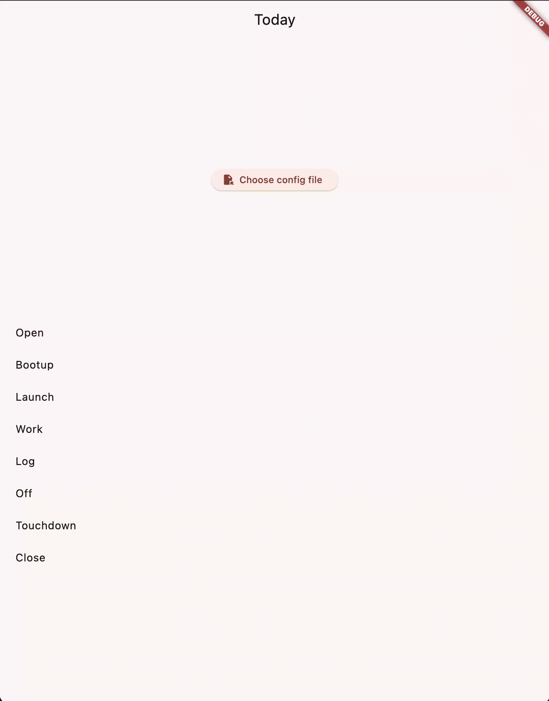

# Monorepo for the Wanderer's Compass Project
## A Compass for Wanderers


The original version of the app used a day structure broken into the following zones:

It also had [footholds](https://www.onelook.com/?w=foothold) (secure positions for advancement):


Both of these will need to be revised.

## Example config.toml
```toml
[schedule]
working_hours = 15
zones = [
      'Open',
      'Bootup',
      'Launch',
      'Work',
      'Log',
      'Off',
      'Touchdown',
      'Close',
]
footholds = [
    'Make the Bed',
    'Open the Windows',
    'Start Coffee',
    'Ping Work Computer',
    'Get Dressed',
    'Walk the Dogs',
    'Close Work Computer',
    'Crate Dogs',
    'Walk the Dogs',
    'Turn off Lights',
    'Close the Windows',
    'Play Wakeup Music',
    'Play Calming Cafe Music',
    'Play with Dogs',
    'Work on Personal Project',
    'Tidy Up',
    'Go on a Walk',
]
```